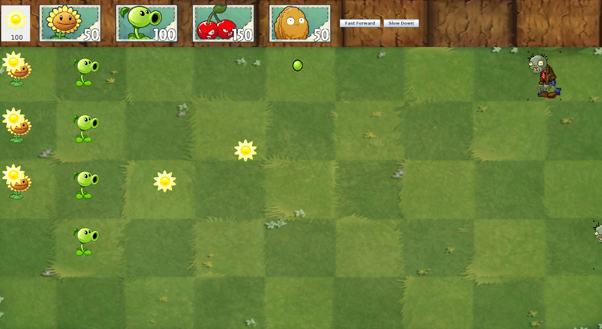

# plantsvszombies-clone
A plants vs zombies clone implemented in Java, created during my first undergraduate year (2016). Demonstrates OOP principles and understanding of threading.

Made with pure Java from scratch without the use of a GUI editor (such as Netbeans or Eclipse) or external libraries.

To run, execute the following commands:
```
cd src
java ControllerDriver
```

